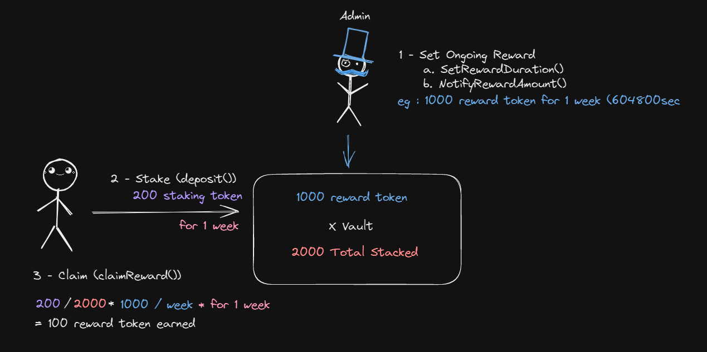
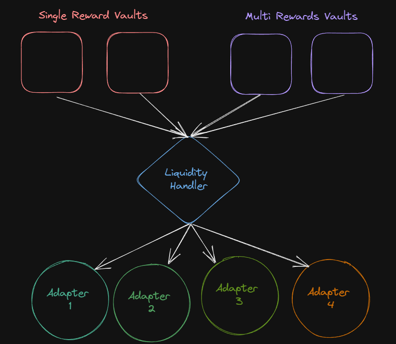

# Contracts Address
## Fantom Testnet
➜  DepositContracts git:(main) ✗ npx hardhat run scripts/deploy_testnet.ts --network fantom_testnet
Test Token 1 (18 decimals) deployed to: 0x18188A8d50cC6f44a4eCB9D112E2F98d47d9491c
Test Token 2 (6 decimals) deployed to: 0xEE4AFC7Bb01672De0c2a568B8CfB47DC41516903
Deepfi Token deployed to: 0xb483aE4D4dE9F0E341d13Ff0A9B3530E84265352
Handler deployed to: 0xb0871E0Eea7ef5783d1a314ca6a33930AeD79795
MLP Vault deployed to: 0xb20Ae26EdFb8E0C7aB44f551012f75d10140C411
MLP Adapter deployed to: 0x991e0100f0d6d308D139B72F8407749e0A34254D
EQZ Vault deployed to: 0xAa076ebE72266A1d977e583cbe5244215A43cD12
EQZ Adapter deployed to: 0xAE5257B5dd895027bE7C9263e810F5f9380AF7D7

## Fantom Mainnet
[WIP]

### Vault Rewards Distribution

### Structure
Deposits and withdrawals are made on the different vaults, which transfer the funds to the liquidity handler in order to dispatch them to the respective strategy (adapter)

# D_Vault_SingleReward Contract
[WIP]
The D_Vault_SingleReward contract is a decentralized finance (DeFi) vault contract that allows users to deposit and earn returns on their deposited assets. It is designed to be upgradeable, allowing for the implementation to be modified and improved over time.

## Features
The D_Vault_SingleReward contract has the following features:

Support for ERC20 tokens: Users can deposit ERC20 tokens into the vault and earn returns on their deposited assets.

Pausable: admins can pause and resume the contract, allowing for maintenance or emergency situations.

Role-based access control: The contract has roles such as PAUSER_ROLE, MINTER_ROLE, and UPGRADER_ROLE that can be assigned and revoked by an authorized party. These roles give parties the ability to perform certain actions on the contract.

Upgradeable: The contract can be upgraded by creating a new contract implementation and replacing the current one.

## Functions
The D_Vault_SingleReward contract has the following functions:

initialize: This function is called when the contract is deployed and is used to set up the contract, including setting the annual interest rate, update time limit, and liquidity handler address.

deposit: This function allows users to deposit ERC20 tokens into the vault.

withdraw: This function allows users to withdraw their deposited assets.

claimReward: claim all user rewards earned by staking.

getRewardBalance: retrieve user available gains balance.

getStakeBalance: retrieve user deposited balance.

getTotalUserEarned : retrieve user claimed asset balance.

setRewardsDuration: allow admins to increase duration of an ongoing reward, or set a new one

notifyRewardAmount: allow admins to increase amount of reward token, or set a new reward

setLiquidityHandler: This function allows admins to set the contract responsible for distributing money between the pool and the strategy.

# LiquidityHandler Contract
[WIP]
The LiquidityHandler contract is a contract that handles liquidity from vaults to adapters. It is designed to be upgradeable, allowing for the implementation to be modified and improved over time.

## Features
The LiquidityHandler contract has the following features:

Liquidity Hub : centralizes and dispatches funds to the different strategies of the protocol, also handles deposit & withdrawals

Pausable: admins can pause and resume the contract, allowing for maintenance or emergency situations.

Role-based access control: The contract has a UPGRADER_ROLE that can be assigned and revoked by admins. This role gives parties the ability to perform certain actions on the contract.

Upgradeable: The contract can be upgraded by creating a new contract implementation and replacing the current one.

## Functions
The LiquidityHandler contract has the following functions:

initialize: This function is called when the contract is deployed and is used to set up the contract, including setting the multi-sig wallet address and protocol governance token address.

deposit: Called by Vault on user demand. This function allows users to deposit assets into the protocol.

withdraw: Called by Vault on user demand. This function allows users to withdraw their deposited assets.

addPool: This function allows admins to add a new Pool to the list of deployed pools.

removePool: This function allows admins to remove a Pool from the list of deployed pools.